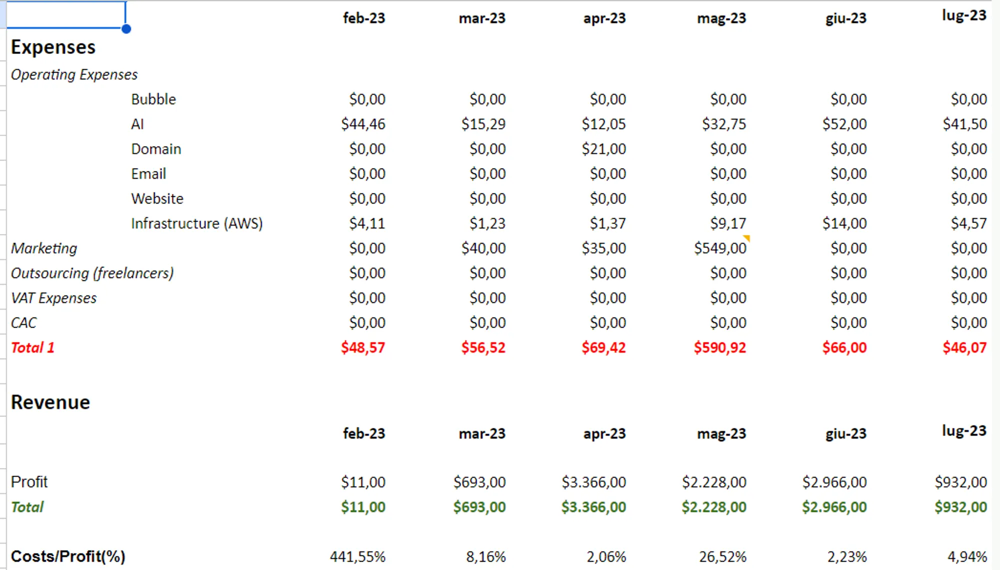

# How to Achieve Efficiency in Your Startup

One of the most valuable lessons I learned as an entrepreneur is how to manage the economics and finances of a product in an efficient way. By efficient, I mean getting more value with fewer resources. This is the concept that I explained in the validation stage chapter of my book. In this post, I will show you how we applied this concept to our latest SaaS product, RecapioGPT, which is a tool that helps you generate summaries and insights from your online meetings.

## Our P&L: A Case Study of Efficiency

To illustrate the importance of efficiency, I will share with you our P&L (profit and loss) statement up to Jul 23. Here is a screenshot of our spreadsheet:

Notice the row named “Costs/Profit(%)”. This is the percentage of our costs over our profit. You can ignore the first month because it’s an outlier. The average of this percentage is about 8%. That means we spend only 8% of our profit on our costs. Then we have an average margin of 92%. That’s a huge amount. If you think about bigger numbers, for example, $10,000, you’ll have a margin of $9,200.

Having such a high margin gives us a competitive advantage and a good price point for the final acquisition. It also allows us to reinvest in our product development and marketing.

## How to Achieve Efficiency: Three Tips

You might be wondering how we achieved such a high level of efficiency. It does not mean that we skimped on our product quality or customer satisfaction. On the contrary, we always aimed to deliver the best value to our users. Here are three tips that helped us do that:

1. **Improve your workflow:** In our AI product, we improved some of our workflows to reduce our costs in terms of AI (OpenAI) and give the final user a better result. For example, we used caching and batching techniques to optimize our API calls and reduce latency.

2. **Use alternatives:** In some cases, we used free or low-cost alternatives to achieve our goals. For example, we spent $0 for a landing page, and we also made a survey + collected emails. With $0, we reached the same goal as a paid service. Look for alternatives around you in terms of costs, but that can give you the same or even better results.

3. **Make a selection:** Sometimes, you have to spend some money to validate your idea or reach your audience. In that case, you should be very selective and rational in your decision. I can give you an example related to the unique TikTok campaign we made. We did not choose the first creators that came out, but we made a selection of a list of creators and chose the best ones in terms of price requested and number of views/videos. That way, we maximized our ROI (return on investment) and minimized our CAC (customer acquisition cost).

## Conclusion

Efficiency is a key factor in validating your ideas and building your products. It can help you save money, time, and resources while delivering more value to your users and potential buyers. I hope these tips will help you achieve efficiency in your own projects.
