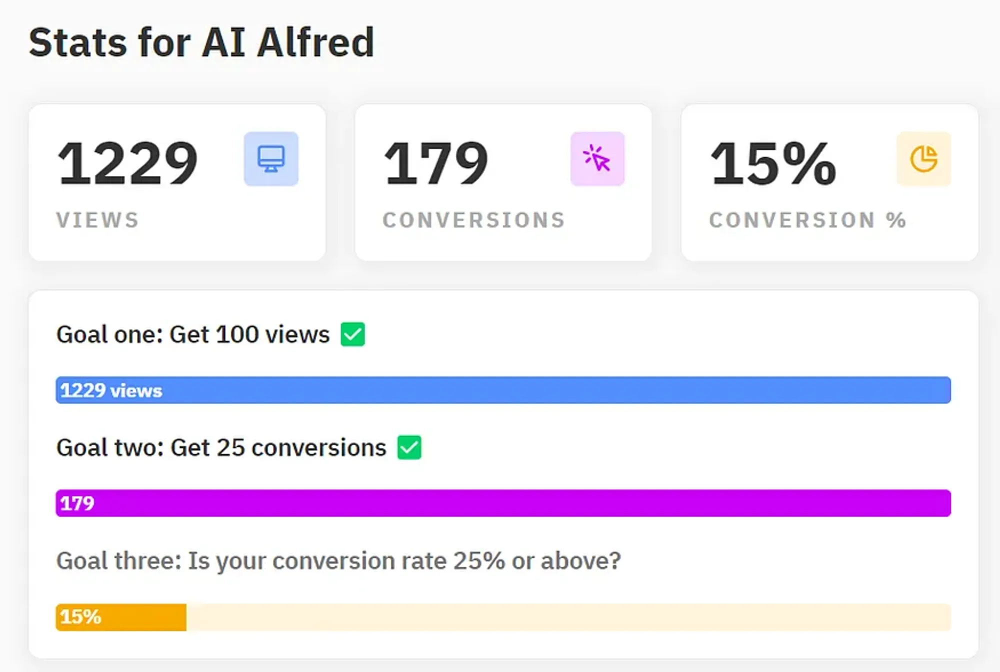

# How to Validate a Startup Idea

As an experienced entrepreneur, I want to share with you some tips on how to validate your ideas before building them. This will save you time, money, and resources, and help you focus on the most promising opportunities.

## What You Need for Validation

To validate your idea, you only need two things:

1. **An idea:** This is the problem you want to solve, the solution you have in mind, and the target market you want to reach.
2. **A landing page:** This is a simple web page that describes your idea, shows some benefits, and collects users’ emails.

You don’t need to build the product yet. That would be wasting time and resources on something you don’t know if it will work or not. Trust me, I’ve been there.

## How to Validate Your Idea

Here is the process I always use for validating my ideas:

1. Once I have an idea, I create a landing page on [Yep.so](https://yep.so/), a website that lets you build landing pages in minutes. I did this for my last two products, and it worked very well. You can see some examples [here](https://yep.so/p/ai-alfred).
2. On the landing page, I explain what my idea is, what problem it solves, and what benefits it offers. I also include some screenshots (fake) of how the product would look like. Then, I add a call to action to collect users’ emails. This way, I can validate my idea without spending money or time, and also build a list of potential beta testers for later.
3. Next, I share the landing page with as many people as possible. I use social media, online communities, forums, blogs, newsletters, and any other channel that is relevant to my target market. The more people see the landing page, the more chances I have to get emails and validate the product as soon as possible.
4. Finally, I analyze the results. I look at the number of views, the number of emails, and the conversion rate. These metrics tell me how much interest and demand there is for my idea.

## How to Interpret the Results

The results of the validation will help you decide whether to proceed with building the product or not. Here are some guidelines to follow:

- A good conversion rate is between 10% and 25%. This means that 10 to 25 out of 100 people who see the landing page sign up for the email list. This indicates that there is a problem worth solving, and that your solution is appealing.
- A bad conversion rate is below 5%. This means that less than 5 out of 100 people who see the landing page sign up for the email list. This indicates that there is no problem, or that your solution is not convincing.
- A goal is a number of emails that you want to collect to validate your idea. This depends on the size of your market, the type of your product, and your personal preference. For example, you can set a goal of 100 emails, 500 emails, or 1000 emails. The higher the goal, the more confident you can be about your idea.

Here are the numbers for one of my last products: RecapioGPT (formerly AI Alfred).

As you can see, I collected 179 emails, and my conversion rate was about 15%. This was a good result, so I decided to build the first beta version and test it with these users.

These users are the most important ones for your product. They are your early adopters, your feedback providers, and your future advocates. Listen to them from day zero, and let them guide your development.

## The Benefits of Validation

What I have described above cost me zero dollars, and very little time to set up the landing page and share it with people. As you can see, you can validate your product without having anything.

This is my vision, and I think you can achieve more with this than spending a lot of time on something you don’t know if it will work.

By validating your idea before building it, you can:

- Avoid wasting time, money, and resources on building something nobody wants
- Find out if there is a problem worth solving, and if your solution is attractive
- Build a list of potential beta testers and customers for your product
- Learn from your target market and their feedback
- Increase your chances of success and growth
