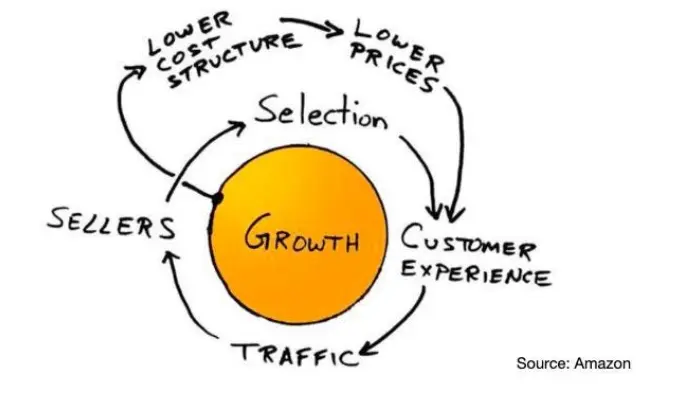

# What is the Amazon Flywheel

Here is the secret that has made Amazon one of the most successful companies in the world. It’s called the Amazon Flywheel, and it’s a simple but powerful idea that can help you grow your business and make your customers happy. The Amazon Flywheel is all about putting your customers first and creating a cycle of growth and satisfaction that never stops. Let me show you how it works and how you can use it for your own business.

## 1. How the Amazon Flywheel Works

The Amazon Flywheel is like a wheel that keeps spinning faster and faster. It has two loops that feed each other:

### First Loop: More Sellers, More Products, Lower Prices

- Amazon lets other sellers sell their products on its platform. This creates more competition and more choices for customers.
- More choices mean lower prices, which make customers happy. Happy customers buy more and come back more often.
- More customers mean more traffic, which attracts more sellers. More sellers mean more growth for Amazon.
  

### Second Loop: More Growth, Lower Costs, Lower Prices

- Amazon grows bigger and bigger, which helps it save money and be more efficient. It can buy in bulk, negotiate better deals, and use technology to automate tasks.
- Lower costs mean lower prices, which make customers happy. Happy customers buy more and come back more often.
- More customers mean more growth, which helps Amazon save more money and be more efficient.

As you can see, the Amazon Flywheel is a win-win situation for both Amazon and its customers. The more it spins, the better it gets.

## 2. How to Use the Amazon Flywheel for Your Business

You might be wondering: how can I use the Amazon Flywheel for my business? Well, the good news is that you don’t have to be Amazon to use it. You just have to follow these six steps:

### 1. Customer-Centric Approach

- Make your customers your number one priority. Listen to their needs, wants, and feedback. Solve their problems and exceed their expectations.
- Happy customers will help you grow your business by leaving positive reviews and telling their friends about you.

### 2. Sustainable Growth

- Keep improving your customer experience by offering more value, quality, and convenience. Don’t settle for good enough, aim for excellence.
- Happy customers will keep coming back and buying more from you, which will boost your revenue and profit.

### 3. Increased Customer Loyalty

- Deliver consistent and excellent customer experiences every time. Don’t let your customers down or disappoint them. Surprise and delight them with extra benefits and rewards.
- Happy customers will become loyal fans and advocates of your brand, which will enhance your reputation and attract new customers.

### 4. Cost Optimization

- Grow your business by reducing your costs and increasing your efficiency. Find ways to save money and time, without compromising on quality or service.
- Lower costs will allow you to offer lower prices, which will make your customers happy and give you a competitive edge.

### 5. Adaptability and Innovation

- Grow your business by adapting and innovating to meet changing customer needs and market trends. Don’t be afraid to try new things and experiment with new ideas. Learn from your failures and successes.
- Happy customers will appreciate your creativity and innovation, which will keep them interested and excited about your brand.

### 6. Data-Driven Decision Making

- Grow your business by using data and metrics to guide your decisions. Don’t rely on gut feelings or opinions, use facts and evidence. Track and measure your performance and results.
- Happy customers will provide you with valuable data and feedback, which will help you improve your products and services.

To sum up, these are the six steps to use the Amazon Flywheel for your business:

- Customer-Centric Approach: Put your customers first and make them happy.
- Sustainable Growth: Keep improving your customer experience and grow your revenue and profit.
- Increased Customer Loyalty: Deliver consistent and excellent customer experiences and build loyal fans and advocates.
- Cost Optimization: Reduce your costs and increase your efficiency and offer lower prices.
- Adaptability and Innovation: Adapt and innovate to meet changing customer needs and market trends.
- Data-Driven Decision Making: Use data and metrics to guide your decisions and improve your products and services.

By following these steps, you can create a cycle of growth and satisfaction that never stops, just like the Amazon Flywheel.
