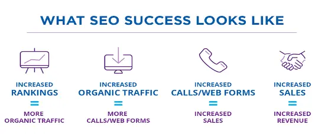
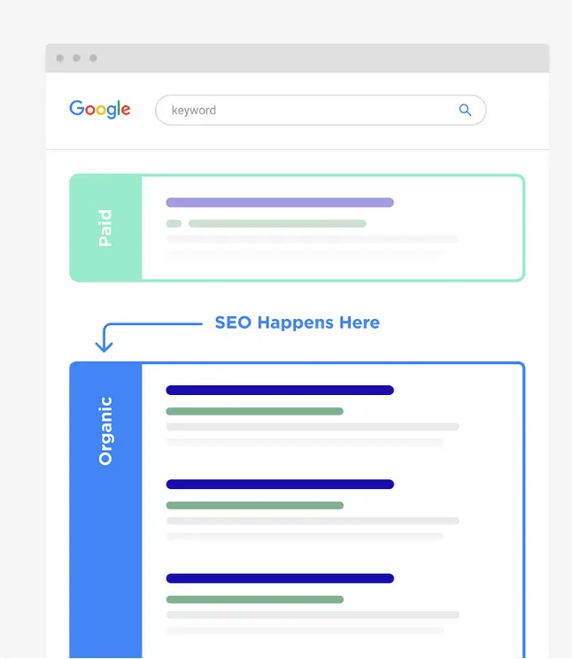
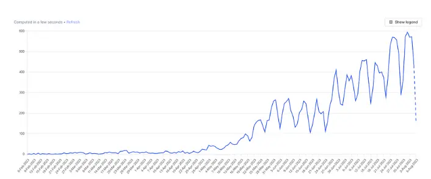

# Why you need SEO for your micro-business

SEO stands for Search Engine Optimization, and it means making your website more visible and attractive to people who search online. SEO can help you get more visitors, customers, and sales without spending any money on ads. Sounds good, right? Let me tell you more about SEO and how you can use it for your business.

## 1. What is SEO?

SEO is the art and science of making your website rank higher on search engines like Google or Bing. When people search for something related to your business, you want your website to show up on the first page of the results. That way, more people will click on your website and see what you have to offer. SEO is different from direct traffic or paid ads, which are other ways to get people to your website. Direct traffic means people type your website address directly into their browser. Paid ads mean you pay money to show your website on search engines or other websites. SEO is better than direct traffic or paid ads because it’s free and it brings you more qualified leads. Qualified leads are people who are already interested in your product or service, so they are more likely to buy from you.

## 2. SEO vs SEM

You may have heard of another term called SEM, which stands for Search Engine Marketing. SEM is similar to SEO, but it also includes paid ads. SEM can help you get more traffic and exposure for your website, but it also costs money and it may not be as effective as SEO. If you want to grow your micro-SaaS business on a budget, SEO is the best option for you.

## 3. SEO Strategies

Now that you know what SEO is and why it’s important, let me show you some SEO strategies that you can use for your micro-SaaS business. I’ll use my own startup, RecapioGPT, as an example. RecapioGPT is a tool that helps you create summaries of any text using AI.

### Keywords

Keywords are the words and phrases that people use to search online. Keywords are the foundation of SEO, because they tell you what your potential customers are looking for and how you can reach them. To find the best keywords for your business, you need to do some research. Here are the steps you need to follow:

1. **List Relevant Topics:** Think of some broad topics that are related to your business. For example, some topics for RecapioGPT are: text summarization, AI writing, content creation, etc.
2. **Create Keyword Buckets:** For each topic, brainstorm some specific keywords that people might use to search for it. For example, some keywords for text summarization are: how to summarize text, text summarizer tool, best text summarizer, etc.
3. **Understand Intent:** For each keyword, try to understand what the searcher wants to achieve or learn. This is called search intent, and it can help you create content that matches their needs. For example, someone who searches for how to summarize text might want to learn the steps or techniques of text summarization, while someone who searches for text summarizer tool might want to find and use a tool that can do it for them.
4. **Research Related Terms:** For each keyword, look for other terms that are related or similar to it. You can use Google to see what other people are searching for, or use tools like Ahrefs, SEMrush, or Ubersuggest to get more ideas. For example, some related terms for text summarizer tool are: text summarizer app, text summarizer online, text summarizer generator, etc.

5. **Utilize Tools:** To make your keyword research easier and faster, you can use tools that can help you find and analyze keywords. Some of the best tools are:

- [Ahrefs](https://ahrefs.com/): A powerful tool that shows you the search volume, difficulty, and ranking potential of any keyword. It also shows you the top-ranking pages for each keyword, and the keywords they use.
- [SE Ranking](https://seranking.com/): A simple tool that shows you the search volume, difficulty, and trends of any keyword. It also shows you the related keywords and the top-ranking pages for each keyword.
- [SEMrush](https://semrush.com/): A popular tool that shows you the search volume, difficulty, and trends of any keyword. It also shows you the related keywords, the top-ranking pages, and the paid ads for each keyword.
- [Ubersuggest](https://neilpatel.com/ubersuggest/): A free tool that shows you the search volume, difficulty, and trends of any keyword. It also shows you the related keywords, the top-ranking pages, and the content ideas for each keyword.
- [Google Keyword Planner](https://ads.google.com/home/tools/keyword-planner/): A free tool that shows you the search volume, difficulty, and trends of any keyword. It also shows you the related keywords and the paid ads for each keyword.
- [Keywords Everywhere](https://keywordseverywhere.com/): A free browser extension that shows you the search volume, difficulty, and trends of any keyword. It also shows you the related keywords and the top-ranking pages for each keyword.

### Website Content

Optimizing website content is equally crucial. Enhance your SEO strategy by:

- Identifying low-performing pages and removing them.
- Improving high-traffic pages by adding visual elements, enhancing readability, and updating content.

You could find pages with the highest traffic in terms of number of views, improve these pages, and relaunch them. How can you improve them?

1. Add visual elements: if your page is 100% text, this is not good for SEO. You should add something: a graph, an image, and more;
2. Read it in a good way: also the reading part should be efficient. The user should have the possibility to understand the content in a very quick and easy way. For example, you could improve your readability on smartphones and other devices, than PC only;
3. Update the pages: you should replace dead links, old images, and everything related to old content. Your website should always stay up to date.

### On-Page SEO

Take on-page SEO seriously by optimizing elements such as:

- Title tags
- Meta descriptions
- Headings
- Internal links
- URLs

[Example from FounderNotes](https://www.foundernotes.io/)

These are only 3 strategies for improving your SEO, and your ranking! We are using most of them for our startup [recapiogpt.com](https://recapiogpt.com/), and these are the results so far.

We started working on SEO 2 months ago. An important point to specify here is that SEO is not a short-term strategy! If you aim to get results in 1 week, this is not the best way. You can do paid ADS, or something else, but not SEO.

SEO is a long-term game, where you can get more results if you invest time and patience. Is that a good investment? Yes!

## Results of SEO Investment

While SEO may not yield immediate results, it's a long-term game that pays off. RecapioGPT started focusing on SEO two months ago and has seen remarkable results. A graph of Organic SEO Unique Users shows a steady increase, with 80% of traffic coming from SEO.

Invest your time in SEO for sustained success in the competitive world of micro-SaaS. Subscribe to insightful newsletters, like Marc-Etienne's, for ongoing strategies and growth tips.

Remember, SEO is not just an investment; it's a winning strategy for the long haul! Start optimizing and watch your micro-SaaS venture thrive.

By using these tools, you can find the best keywords for your business and optimize your content for them.
